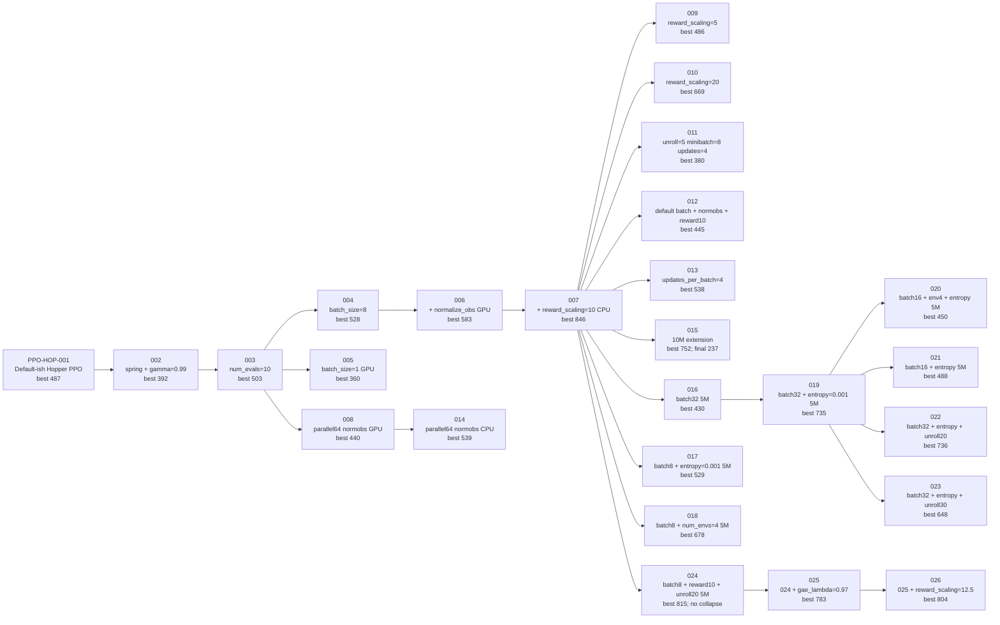
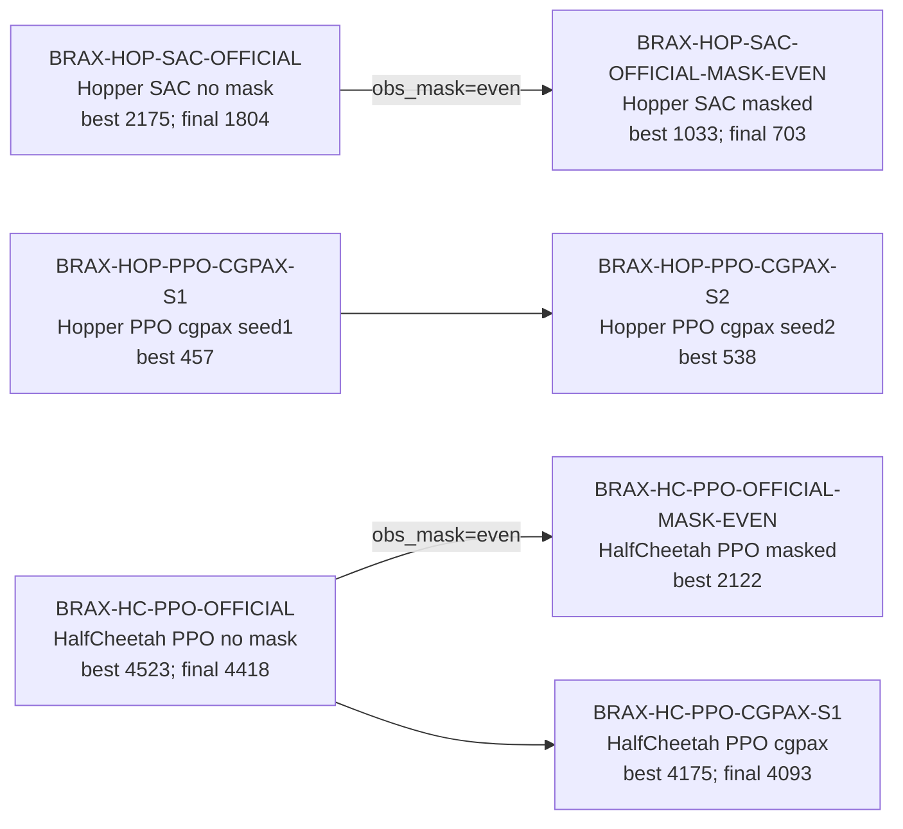
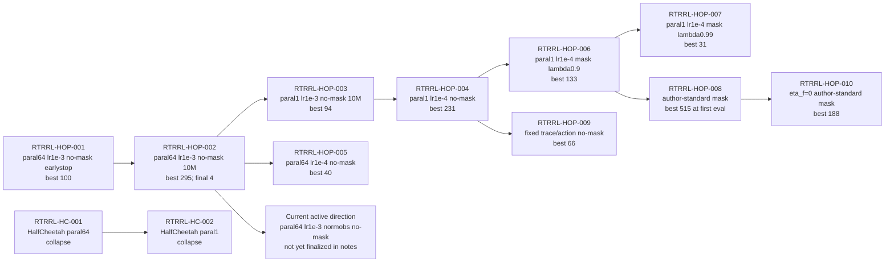

# Experiment Parameter Evolution

This file summarizes the main parameter evolution paths currently recorded in
Aim. It is intended as a compact presentation aid rather than a full run log.

## Hopper PPO Exploration

Key reading:

- `PPO-HOP-007` remains the strongest 2M Hopper PPO run.
- `PPO-HOP-024` is the most useful longer PPO branch: it is no-mask, improves
  steadily to about `815`, and does not show late collapse within 5M.
- `PPO-HOP-015` is the clearest late-collapse example: it peaks near `752` and
  falls to about `237` by 10M.
- None of the Hopper PPO exploration runs reaches the official SAC level.

## Brax Baseline Anchors

Key reading:

- Hopper's strongest baseline is official SAC, not the explored PPO settings.
- Masked Hopper SAC still reaches about `1033`, but is much noisier than no-mask
  SAC.
- HalfCheetah PPO validates that the baseline pipeline works; masking lowers the
  reward substantially but does not prevent learning.

## RTRRL Hopper And HalfCheetah

Key reading:

- Current RTRRL results are not yet strong enough to claim Brax reproduction.
- `paral64` helps Hopper relative to `paral1`, but this may mean parallel envs
  are acting like batch learning.
- Masked RTRRL remains weak or ambiguous; `RTRRL-HOP-008` has high best reward,
  but the best occurs at the first eval, so it should not be treated as a
  learned curve.
- HalfCheetah RTRRL currently collapses.
