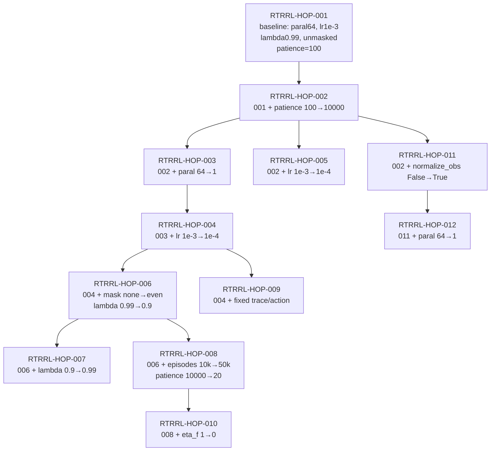

# RTRRL Hopper Parameter Evolution

Color rule: green means the value increased
relative to the parent run; red means it
decreased. Colors indicate direction only, not quality.

| Run | Parent | Core change | paral | mask | norm_obs | lr | lambda | episodes | patience | best eval | last eval | duration |
|---|---|---|---:|---|---|---:|---:|---:|---:|---:|---:|---:|
| RTRRL-HOP-001 | root | baseline | 64 | none | False | 1e-3 | 0.99 | 10000 | 100 | 100.30 | 28.27 | 91.4m |
| RTRRL-HOP-002 | 001 | patience 100→10000 | 64 | none | False | 1e-3 | 0.99 | 10000 | 10000 | 295.41 | 4.36 | 181.7m |
| RTRRL-HOP-003 | 002 | paral 64→1 | 1 | none | False | 1e-3 | 0.99 | 10000 | 10000 | 93.88 | 20.79 | 92.9m |
| RTRRL-HOP-004 | 003 | lr 1e-3→1e-4 | 1 | none | False | 1e-4 | 0.99 | 10000 | 10000 | 230.95 | 73.41 | 100.4m |
| RTRRL-HOP-005 | 002 | lr 1e-3→1e-4 | 64 | none | False | 1e-4 | 0.99 | 10000 | 10000 | 40.30 | 18.70 | 92.0m |
| RTRRL-HOP-006 | 004 | mask none→even + lambda 0.99→0.9 | 1 | even | False | 1e-4 | 0.9 | 10000 | 10000 | 132.58 | 61.78 | 100.1m |
| RTRRL-HOP-007 | 006 | lambda 0.9→0.99 | 1 | even | False | 1e-4 | 0.99 | 10000 | 10000 | 30.50 | 4.76 | 111.5m |
| RTRRL-HOP-008 | 006 | episodes 10k→50k + patience 10000→20 | 1 | even | False | 1e-4 | 0.9 | 50000 | 20 | 514.85 | 21.81 | 98.4m |
| RTRRL-HOP-009 | 004 | fixed trace/action implementation | 1 | none | False | 1e-4 | 0.99 | 10000 | 10000 | 65.63 | 14.01 | 97.1m |
| RTRRL-HOP-010 | 008 | eta_f 1→0 | 1 | even | False | 1e-4 | 0.9 | 50000 | 20 | 187.58 | 64.28 | 90.5m |
| RTRRL-HOP-011 | 002 | normalize_obs False→True | 64 | none | True | 1e-3 | 0.99 | 10000 | 10000 | 230.25 | 136.62 | 181.0m |
| RTRRL-HOP-012 | 011 | paral 64→1 | 1 | none | True | 1e-3 | 0.99 | 10000 | 10000 | 20.06 | 14.54 | 94.5m |

Notes:

- `RTRRL-HOP-008` has a high best eval, but the best point is at step `1000`
  (first eval), so it should not be interpreted as a learned curve.
- `RTRRL-HOP-011` is the current local `paral64 + normalize_obs + lr=1e-3 +
  no-mask` run. It is below `RTRRL-HOP-002` in best eval, but has a higher final
  eval value.
- `RTRRL-HOP-012` shows the same normalize-observation setting with `paral=1`
  remains weak.
